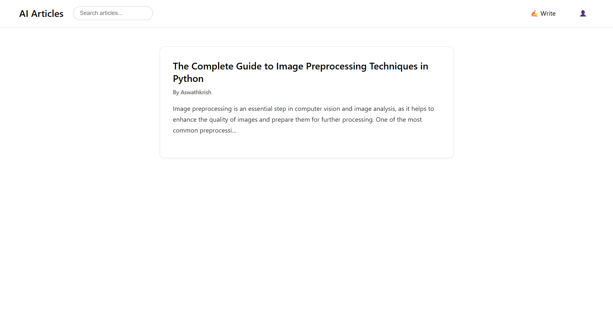
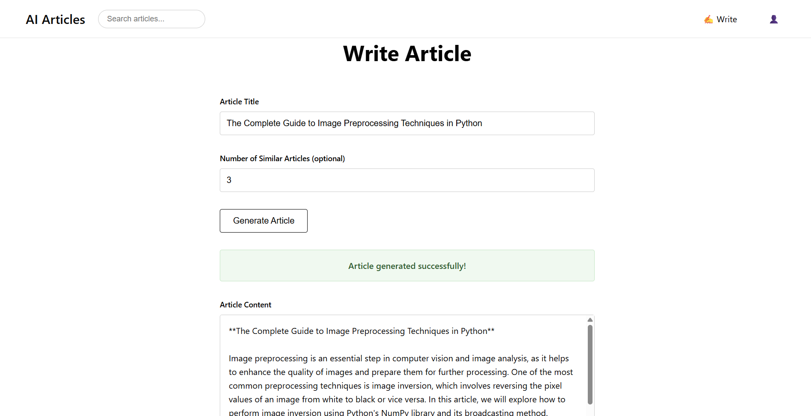
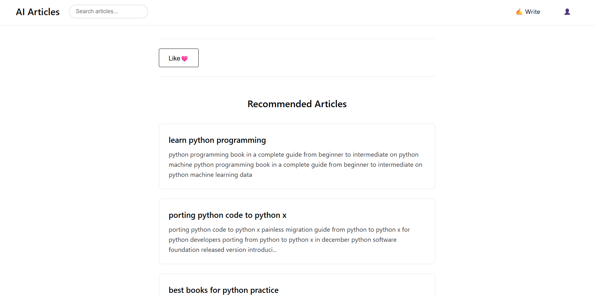
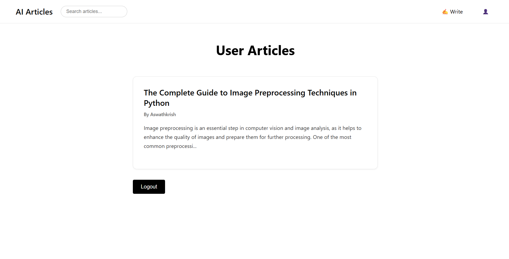

# ArtiCraft: AI Article Platform

ArtiCraft is an AI-powered article platform that enables users to generate, recommend, and manage articles using advanced NLP and machine learning models. The platform features user authentication, article creation and personalized article recommendations.

---

## Features

- **User Registration & Login**: Secure authentication system for users.
- **Article Generation**: Generate high-quality articles using LLMs and reference articles.
- **Article Recommendation**: Get personalized article recommendations based on semantic similarity.
- **Like & Unlike Articles**: Users can like or unlike articles.
- **User Profiles**: View articles authored by a user.
- **Static Frontend**: Responsive HTML/CSS/JS frontend for a seamless user experience.
- **API-First**: FastAPI backend with RESTful endpoints.
- **Vector Search**: Uses FAISS and transformer embeddings for semantic search.

---

## Tech Stack

- **Backend**: Python, FastAPI, SQLAlchemy, FAISS, LangChain, HuggingFace, Groq LLM
- **Frontend**: HTML, CSS, JavaScript (static files in `/static`)
- **Database**: MySQL (configurable via `.env`)
- **ML/NLP**: Sentence Transformers, TF-IDF, Nearest Neighbors

---

## Project Structure

```
├── main.py                # FastAPI app entry point
├── models.py              # SQLAlchemy ORM models
├── database.py            # DB connection and session
├── schemas.py             # Pydantic schemas for API
├── generate_module.py     # Article generation logic (LLM, vector search)
├── recommend_module.py    # Article recommendation logic
├── auth.py                # (Optional) Auth helpers
├── static/                # Frontend static files (HTML, CSS, JS)
├── models/                # ML models and vectorizers
├── vector_db/             # FAISS vector index
├── documents/             # Reference documents (PDFs)
├── images/                # Generated plots and images
├── testing/               # Notebooks and scripts for development
└── ...
```

---

## Setup & Installation

1. **Clone the repository**

```bash
git clone <repo-url>
cd ArtiCraft
```

2. **Install dependencies**

```bash
pip install -r requirements.txt
```

3. **Configure Environment**

- Create a `.env` file in the root directory:

```
DATABASE_URL=mysql+pymysql://<user>:<password>@localhost/<dbname>
GROQ_API_KEY=your_groq_api_key
```

4. **Prepare the Database**

```bash
python create_db.py
```

5. **Prepare Vector DB and Models**

- Ensure `vector_db/` and `models/` folders contain the required files:
    - `vector_db/index.faiss`, `vector_db/index.pkl`
    - `models/tfidf_vectorizer.pkl`, `models/tfidf_matrix.pkl`, `models/nearest_neighbors.pkl`, etc.

6. **Run the Application**

```bash
uvicorn main:app --reload
```

7. **Access the Frontend**

- Open `static/index.html` in your browser or serve the `static/` folder using any static server.

---

## API Endpoints (Sample)

- `POST /register` — Register a new user
- `POST /login` — Login user
- `POST /articles/create` — Create a new article
- `GET /articles` — Get random articles
- `GET /articles/{id}` — Get article by ID + recommendations
- `POST /articles/generate` — Generate article content
- `POST /articles/{id}/like` — Like/unlike an article
- `GET /users/{id}/articles` — Get articles by user
- `POST /recommend-articles/` — Get article recommendations

---

## Screenshots

- 
- 
- 
- 
